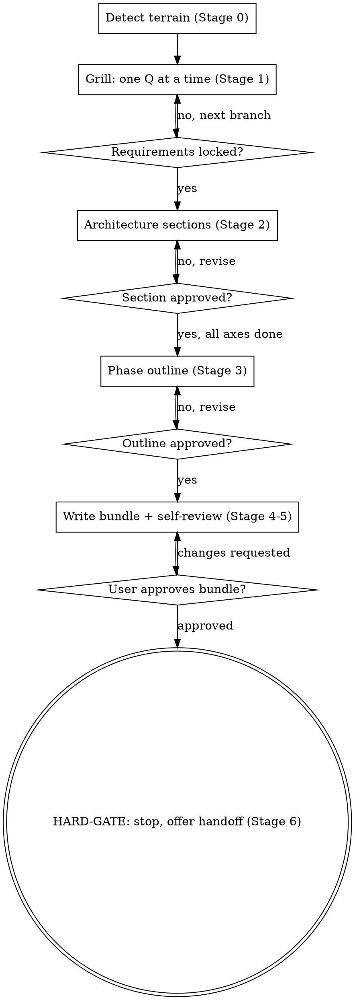

# Zumen

Turn a fuzzy idea into a crystal-clear, well-architected, phased plan — and write it out as a
`plans/` documentation bundle. zumen **interviews** the user to lock requirements (the
`grill-me` technique), **co-designs** the architecture (the `brainstorming` technique), **phases**
the work, then **writes the docs and STOPS**. It plans; it does not implement.

This skill is **domain-neutral** — it carries no project's specifics. When it runs inside a repo that
has a `CLAUDE.md`, it reads it and makes the output *conform* to that repo's house rules, but it never
bakes one project's conventions into another's plan.

## When to invoke

- `/zumen`
- "plan / spec / scope / zumen this project (or feature)"
- "help me design the architecture / pick a stack / choose a database"
- "break this into phases" / "make me a task plan"
- "interview me / grill me about what I want to build"
- A user describes something they want to build and the requirements aren't yet pinned down.

## When NOT to use

- **Stress-testing an existing plan with no artifact wanted** → that's bare [`grill-me`](../grill-me/SKILL.md).
- **The change is a trivial one-liner / config tweak / obvious bugfix.** No 4-doc ceremony — at most a
  single decision-record note if a real choice was made. Say so and stop.
- **The user wants you to start coding now.** zumen produces plans, not code. If they want
  implementation, this is the wrong skill — point them past the gate.
- **The feature already exists.** If exploration shows it's already built, say so; don't manufacture a plan.

## What it produces

A `plans/` bundle mirroring this repo's convention (full mirror — no `pm/` tier):

| File | Holds |
|---|---|
| `plans/product.md` | WHO / WHY / WHAT — users, scope, non-goals, success criteria, committed decisions |
| `plans/architecture.md` | HOW — tech-stack table, component diagram, domain model, API/auth/storage |
| `plans/task.md` | WHEN — phases, each with goal / deliverables / dependencies + S/M/L subtask checkboxes |
| `plans/decisions/YYYY-MM-DD-<topic>.md` | The interview itself — every recommended question + chosen option + why |

Default location is `plans/`. Respect an established alternative if the repo already uses one
(`docs/`, `design/`); default to `plans/` when ambiguous.

## The skill's "driver" — read these before writing

The exact doc shapes live in committed template files. **Copy the matching template and fill it** —
never reconstruct a doc's structure from memory.

- `templates/product.md`, `templates/architecture.md`, `templates/task.md`, `templates/decision-record.md`
- `templates/interview-scratchpad.md` — the resumability checkpoint (see Stage 1.5)
- `references/interview-checklist.md` — the ordered decision-tree branch map the grill walks (load at Stage 1)

(Paths are relative to this skill directory: `.claude/skills/zumen/`.)

## Stages — create a task per stage and complete them in order

### Stage 0 — Frame & detect terrain (no questions yet)
- Read `CLAUDE.md` / `README` / root manifests (`package.json`, `pyproject.toml`, `go.mod`, …).
- **Greenfield vs existing-repo:** a manifest, a non-empty source tree, or a stack-describing
  `CLAUDE.md` ⇒ existing-repo. An empty / idea-only directory ⇒ greenfield.
- **CREATE vs EXTEND:** glob `plans/{product,architecture,task}.md` + `plans/decisions/`. Present ⇒
  **EXTEND** (load them, summarize current state back to the user, then add/append rather than
  overwrite). Absent ⇒ **CREATE**.
- **Scope check:** if the ask is really several independent subsystems, flag it and offer to zumen
  the first slice rather than boil the ocean.
- Announce the detected mode in one line and get a one-word confirm before grilling.
  *e.g. "Existing Next.js repo with a plans/ bundle on Phase 10 — I'll explore the code and EXTEND the
  plans. Go?"*

### Stage 1 — Grill (requirements interview)
Walk `references/interview-checklist.md` branch-by-branch, dependencies-first. Hard rules:
- **ONE question per turn.** Never batch. Wait for the answer before the next question.
- **Every question carries a recommended answer + a one-line why.** Prefer A/B/C when the option space is small.
- **Explore, don't ask.** Before asking, check whether the codebase already answers it. If it does,
  *state the reuse and cite the file* ("`package.json:23` pins `next@15`; reusing it") and move on.
  Only ask when the code is silent or the feature diverges from precedent.
- Append every resolved question (Q + recommendation + the user's pick) to the scratchpad (Stage 1.5).
- Stop when no open branch blocks the architecture pass. Summarize the locked requirements and get an
  explicit "yes, that's it."

### Stage 1.5 — Checkpoint (continuous, lightweight)
Maintain `plans/.zumen-<topic>-scratch.md` from `templates/interview-scratchpad.md`. Update it after
every answered question and every approved architecture section — log the *resolution*, not the
transcript. On a fresh invocation, if a scratch file for this topic exists, read it, summarize "last
resolved = X; next = Y," and resume from `## Next action` — **never restart the interview.**

### Stage 2 — Architecture proposal & discussion
Enter only once requirements are locked. For each genuinely-open axis (stack, datastore, infra/deploy,
key integrations, and the 1-2 hard problems specific to this feature):
- Present **2-3 approaches** with a compact trade-off; **lead with the recommendation + why.**
- **Present in sections scaled to complexity, and get approval after each** before continuing. No
  single architecture wall-dump.
- **Existing-repo discipline:** default to the established stack. Open an axis only when the feature
  forces something new ("you need a job queue; the repo has none — here are 3 options"). Do not
  re-litigate settled choices.
- Every axis that had real alternatives becomes a QN in the decision record.

### Stage 3 — Phasing & complexity
- Decompose the approved design into `## Phase N — Title (timeline)` blocks, each with **Goal:** /
  **Deliverables:** / **Dependencies:** + subtask checkboxes.
- Rate each subtask **S/M/L** (`S = ≤1 day · M = 2–4 days · L = 5+ days`). EXTEND mode: reuse the
  repo's existing legend.
- Sequence by dependency (foundation → data model → core flows → integrations → polish → hardening);
  mark parallelizable phases in the sequencing note.
- **EXTEND mode: continue numbering** — never renumber existing phases.
- Present the phase outline for approval before writing.

### Stage 4 — Write the bundle (copy templates, fill them)
- Resolve the output dir (create `plans/` if missing). **Write ONLY under the planning dir — never source code.**
- For each doc, **copy the matching `templates/` skeleton and fill it.**
- **CREATE** ⇒ write all four (`product.md`, `architecture.md`, `task.md`, `decisions/YYYY-MM-DD-<topic>.md`).
- **EXTEND** ⇒ surgically update the three standing docs (add sections, append phases, amend
  open-questions with the `~~struck~~ **Resolved (date):**` pattern) and **always append a NEW** dated
  decision record — never overwrite an existing one.
- **Cross-link** product ↔ architecture ↔ task with relative links; add `(decided YYYY-MM-DD — see
  decisions/…)` citations at touched spots. The decision record ends with `## Where the decisions
  landed`, pointing at real phases (and code paths in existing-repo mode).
- **Date = real today**, fetched from the environment — never guessed (filenames and citations depend on it).
- **Conform to the host repo's CLAUDE.md** house rules; inject none of any other project's specifics.

### Stage 5 — Self-review + approval gate
Self-review with fresh eyes:
1. **Placeholder scan** — no `{{…}}` tokens or `TODO`s left.
2. **Internal consistency** — architecture matches product scope; phases cover every deliverable.
3. **Cross-link integrity** — every link resolves; the decision record cites phases that exist.
4. **Scope sanity** — focused enough for one bundle, or flag for decomposition.

Fix issues inline. Then ask the user to review the written bundle; on change requests, edit and re-review.

### Stage 6 — TERMINAL HARD-GATE

<HARD-GATE>
zumen STOPS at approved docs. Do NOT write code, scaffold a project, run migrations, install
dependencies, or invoke any implementation skill — regardless of how simple the next step seems.
</HARD-GATE>

State the stop and offer the handoff as a **fresh** invocation:
*"Plans written and approved. zumen stops here — want me to start Phase 0 in a new session?"*

## Conversation → doc mapping

| Conversation stage | Lands in |
|---|---|
| Stage 1 requirements (who/why/what, non-goals, success) | `product.md` |
| Stage 2 architecture (stack table, components, data model, APIs, auth, storage) | `architecture.md` |
| Stage 3 phases + S/M/L subtasks | `task.md` |
| Every recommended question + chosen option + the why (Stages 1 **and** 2) | `decisions/YYYY-MM-DD-<topic>.md` |

## Process flow

## Rules

- **One question at a time.** The grill is not a questionnaire. Batched questions overwhelm and skip the
  dependency ordering that makes later answers cheap.
- **Always recommend.** Every question leads with your recommended answer and a one-line why — the user
  edits a draft, they don't fill a blank.
- **Explore before asking.** A question the codebase already answers is a wasted question. Cite the file
  and move on.
- **Never invent.** Unknown requirement → ask, or (in a compressed interview) record the assumed default
  in `product.md` → Open questions. Never silently fill a gap with plausible prose.
- **Copy templates; don't free-hand structure.** The format is pinned in `templates/` so your budget
  goes to content.
- **Real date, every time.** Fetch today from the environment for filenames and citations.
- **EXTEND is additive.** Update standing docs surgically; append (never overwrite) decision records;
  continue phase numbering; surface conflicts instead of silently overriding them.
- **Stay generic.** This skill conforms to the host repo's CLAUDE.md but carries no project's specifics.
- **The gate is absolute.** zumen ends at approved docs. Implementation is a separate invocation.

## Edge cases & gotchas

- **"Just write the plan" (skip the interview).** Don't refuse forever — run a *compressed* interview:
  ask only the load-bearing branches (the ones that change the architecture), recommend defaults for the
  rest, and list the assumed defaults explicitly in `product.md` → Open questions.
- **Existing plans/ has a conflicting decision.** Never silently overwrite. Surface it; the new record
  documents the superseding decision with a `Supersedes: decisions/<old>.md QN` line, and the touched
  standing doc gets a `**Resolved (date):**` amendment. Decision records are append-only history.
- **House rules vs generic skill.** In a repo with a `CLAUDE.md`, conform (e.g. money-as-`Int` ⇒ the
  architecture uses integer money; dual i18n catalogs ⇒ every UI phase gets the "update both catalogs"
  subtask). But the skill's own templates stay neutral — no hard-coded domain terms.
- **Greenfield with no name/stack.** Establish a working project name + one-liner first (titles need
  them), then go deeper.
- **Monorepo.** Scope exploration to the target package; keep `plans/` at repo root; note the target
  workspace in architecture.md's repo-layout.
- **Output collision.** Stat before writing; if `decisions/YYYY-MM-DD-<topic>.md` already exists, refine
  the slug or suffix `-2` — never clobber.
- **Scope too big for one bundle.** Decompose first; zumen the first sub-project; note the rest as
  future bundles. Don't emit a 12-phase `task.md` that's really four projects.

## Worked example (the two trickiest shapes)

A filled decision-record QN block:

> ## Q3 — Where do click events get stored?
>
> **Why asked:** the analytics requirement (≤10M clicks/mo, dashboards by day/referrer) drives the
> datastore, and it's expensive to change later.
>
> | Option | Trade-off |
> |---|---|
> | **Postgres, one row per click + a rollup table** ⭐ | One datastore to run; SQL dashboards are trivial; fine to ~10M/mo. Rollups need a nightly job. |
> | ClickHouse | Purpose-built for this; another stateful service for a v1 that doesn't need the scale yet. |
> | Append to Redis, flush in batches | Fast writes; durability + query story both weaker. |
>
> **Selected: Postgres + rollup table** — one fewer service to operate; revisit ClickHouse only if
> click volume crosses ~10M/mo (logged in product.md → Open questions).

A filled task.md phase block:

> ## Phase 1 — Core shorten + redirect (Week 1)
> **Goal:** a working short-link create + resolve path, persisted.
> **Deliverables:** `POST /links` returns a slug; `GET /:slug` 302-redirects; links survive restart.
> **Dependencies:** Phase 0.
>
> - [ ] `links` table + migration (slug unique, target URL, created_at) — **S**
> - [ ] Slug generator (base62, collision-retry) — **S**
> - [ ] `POST /links` create endpoint + validation — **M**
> - [ ] `GET /:slug` redirect with not-found handling — **S**
